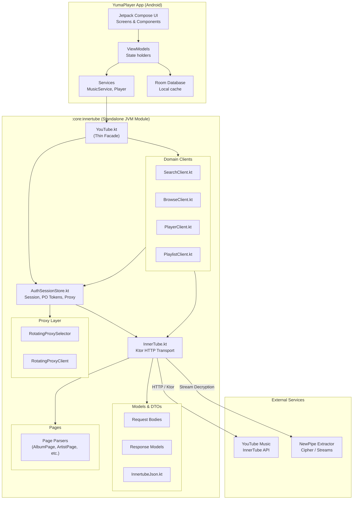

<div align="center">

  <h1>YumaPlayer Core</h1>

  <p align="center">
    <strong>InnerTube API client for YouTube Music.</strong>
    <br />
    <em>The core library powering <a href="https://github.com/MuwMx/YumaPlayer">YumaPlayer</a> — a high-performance, privacy-focused YouTube Music client for Android. Forked from <a href="https://github.com/rukamori/ArchiveTune">ArchiveTune</a>.</em>
  </p>

  <p align="center">
    
    
    
    
    
  </p>

  <a href="https://star-history.com/#MuwMx/YumaPlayer&Date">
    <picture>
      <source media="(prefers-color-scheme: dark)" srcset="https://api.star-history.com/svg?repos=MuwMx/YumaPlayer&type=Date&theme=dark" />
      <source media="(prefers-color-scheme: light)" srcset="https://api.star-history.com/svg?repos=MuwMx/YumaPlayer&type=Date" />
      
    </picture>
  </a>

</div>

## Overview

This is the standalone InnerTube API core originally extracted from [ArchiveTune](https://github.com/rukamori/ArchiveTune), now maintained as part of [YumaPlayer](https://github.com/MuwMx/YumaPlayer). It provides a complete Ktor-based HTTP client for interacting with YouTube Music's InnerTube API, including request signing, response parsing, proxy rotation, and playback authentication.

## Features

- **Full API Coverage** — search, browse, library, playlist management, playback, and account interactions
- **Ktor Client** — built on Ktor with OkHttp engine, content negotiation, brotli encoding, and DNS-over-HTTPS
- **Response Parsing** — complete set of Kotlinx Serialization models for InnerTube responses
- **Page Parsers** — domain-level parsers that transform raw JSON into typed page objects
- **Proxy Rotation** — built-in rotating proxy selector with cooldown tracking for failed proxies
- **Playback Auth** — PO token management for authenticated playback
- **NewPipe Integration** — optional cipher deobfuscation and stream URL extraction via NewPipe Extractor

## Architecture

The diagram below shows how this library fits into the YumaPlayer app (originally ArchiveTune) and how data flows through the layers.



**Data flow:**
1. User interacts with YumaPlayer's Compose UI
2. ViewModels & Services call `YouTube.*` methods
3. `YouTube` fan-outs to domain clients (`Search/Browse/Player/Playlist`) sharing one `InnerTube` transport via `AuthSessionStore`
4. `InnerTube` builds signed requests, sends them via Ktor to YouTube Music's InnerTube API
5. Raw JSON responses are deserialized into typed response models
6. Page parsers transform structured responses into domain page objects
7. For playback, stream URLs are decrypted via NewPipe Extractor (optional)

## Package Structure

```
core/innertube/src/main/kotlin/moe/rukamori/archivetune/innertube/
├── YouTube.kt                — High-level facade (main entry point)
├── AuthSessionStore.kt       — Centralized auth state, tokens & proxy configuration
├── SearchClient.kt           — Search suggestions and query execution
├── BrowseClient.kt           — Catalogs, artist/album details, and browse continuations
├── PlayerClient.kt           — Playback resolution, streaming tokens, and queue tracking
├── PlaylistClient.kt         — Mutations, playlist creation, and batch track operations
├── InnertubeJson.kt          — Pure JSON parsers and response tree extractors
├── InnerTube.kt              — Low-level Ktor HTTP client
├── MusicBackend.kt           — InnerTube client interface contract
├── PlaybackAuthState.kt      — Authentication state model
├── SearchFilter.kt           — Search query filters
├── LibraryFilter.kt          — Library sorting & filter helpers
├── models/                   — DTOs & response deserialization targets
├── pages/                    — Response-to-domain page mappers
├── proxy/                    — Rotating proxy selectors and fetchers
└── utils/                    — Shared module utilities
```

## Dependencies

- **Ktor Client** 3.5.1 — HTTP client core, OkHttp engine, content negotiation, brotli encoding, JSON serialization
- **OkHttp** 5.4.0 — DNS-over-HTTPS support
- **Kotlinx Serialization** — JSON deserialization
- **NewPipe Extractor** 0.26.3 — stream URL extraction, cipher deobfuscation, Bandcamp/SoundCloud search
- **re2j** 1.8 — Google RE2 regular expressions
- **Rhino** 1.9.1 — JavaScript engine (cipher operations)

## Usage

```kotlin
// Search
val results = YouTube.search("query", SearchFilter.SONGS)

// Browse
val home = YouTube.home()
val album = YouTube.album("browse_id")
val artist = YouTube.artist("browse_id")
val playlist = YouTube.playlist("playlist_id")

// Player
val player = YouTube.player("video_id", "playlist_id", YouTubeClient.WEB)

// Playlist management
YouTube.createPlaylist("My Playlist", "description")
YouTube.addToPlaylist("playlist_id", listOf("video_id"))

// Auth
YouTube.authState = PlaybackAuthState(cookie = "...", visitorData = "...")
```

## License

[GNU General Public License v3.0](LICENSE)
